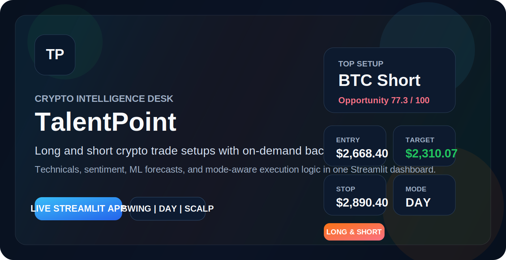

# TalentPoint

<p align="center">
  <a href="https://crypto-investor-mvp-gxv6u8tvd7btcjyr3fx26n.streamlit.app/"></a>
  
  
  
  
</p>

<p align="center">
  Streamlit application for ranking major cryptocurrencies, generating long and short trade setups, and running on-demand historical backtests across swing, day, and scalp trading modes.
</p>

<p align="center">
  <strong><a href="https://crypto-investor-mvp-gxv6u8tvd7btcjyr3fx26n.streamlit.app/">Launch the live app</a></strong>
</p>

<p align="center">
  <a href="https://crypto-investor-mvp-gxv6u8tvd7btcjyr3fx26n.streamlit.app/"></a>
</p>

## Live App

### [Open the deployed Streamlit app](https://crypto-investor-mvp-gxv6u8tvd7btcjyr3fx26n.streamlit.app/)

If the app has just been updated, give Streamlit a minute to finish rebuilding before refreshing the page.

## App Preview

<p align="center">
  <a href="https://crypto-investor-mvp-gxv6u8tvd7btcjyr3fx26n.streamlit.app/">
    
  </a>
</p>

## Overview

TalentPoint is a crypto research and trading decision-support dashboard built with Streamlit. It scans a curated universe of large and actively traded crypto assets, scores them across multiple lenses, and turns the strongest ideas into clear trade-ready outputs.

The app combines:

- technical analysis
- market-structure and fundamental scoring
- news and community sentiment
- machine-learning direction and forecast signals
- long and short trade setup generation
- on-demand historical backtesting

This is not an execution bot and it is not financial advice. It is designed to help you inspect market structure, compare opportunities, and evaluate strategy behavior more transparently.

## Key Features

- Live market scan across a multi-asset crypto universe
- Long and short trade predictions instead of long-only bias
- Three trading modes: `swing`, `day`, and `scalp`
- Entry, stop-loss, take-profit, expected return, and risk/reward outputs
- On-demand historical backtests by asset and strategy mode
- Transparency reports for individual assets
- Watchlist support and persistent selected-asset detail panels
- Interactive rankings table with score bars and price sparklines
- Streamlit frontend with tabs for overview, picks, universe, and backtests

## Data Sources

- `Yahoo Finance` via `yfinance` for OHLCV price history
- `CoinPaprika` for market metadata and supply context
- `RSS feeds`, `Reddit RSS`, and optional `CryptoPanic` for sentiment inputs
- `Alternative.me Fear & Greed Index` for market-wide mood context
- `GitHub API` for developer-activity proxy data

## What The App Produces

For each analysed asset, TalentPoint can generate:

- technical, fundamental, sentiment, and ML scores
- a combined final score
- a directional trade setup: `long`, `short`, or mixed
- suggested entry, stop-loss, and take-profit levels
- leverage and risk context
- transparency and reasoning reports

## Trading Modes

The app supports three strategy modes:

- `Swing`: daily-bar positioning for roughly 20-60 day trades
- `Day`: hourly-bar setups for roughly 1-3 day trades
- `Scalp`: 15-minute intraday setups for sub-day trading

These modes affect:

- forecast horizon
- classification threshold
- holding window
- stop-loss and target scaling
- transaction-cost assumptions
- backtest history window

## Backtesting

TalentPoint includes a real historical backtesting module that can be run on demand by:

- asset
- trading mode
- historical period
- starting capital

Current backtests use real historical OHLCV together with the executable strategy logic, including:

- technical signals
- ML forecasts
- long and short setup logic
- mode-specific holding rules
- fees and slippage assumptions

Historical sentiment is excluded from backtests because reliable archival sentiment data is difficult to source consistently.

## Run Locally

```bash
pip install -r requirements.txt
streamlit run app.py
```

Optional environment variables:

- `CRYPTOPANIC_API_KEY`
- `GITHUB_TOKEN`
- `COINPAPRIKA_RATE_LIMIT`
- `LOG_LEVEL`

## Project Structure

```text
crypto-investor-mvp/
├── app.py
├── config.py
├── data/
│   ├── market_data.py
│   └── news_data.py
├── analysis/
│   ├── technical.py
│   ├── fundamental.py
│   ├── sentiment.py
│   └── ml_forecast.py
├── backtesting/
│   ├── engine.py
│   └── service.py
├── scoring/
│   └── engine.py
├── strategy/
│   ├── entry_exit.py
│   └── risk.py
├── utils/
│   └── helpers.py
├── LICENSE
├── README.md
├── ARTICLE.md
├── ROADMAP_FULL_PRODUCT.md
└── PR_LONG_SHORT_TRADE_PREDICTIONS.md
```

## Live Deployment Notes

- Main app entrypoint: `app.py`
- Hosted on Streamlit Community Cloud
- Live URL: [https://crypto-investor-mvp-gxv6u8tvd7btcjyr3fx26n.streamlit.app/](https://crypto-investor-mvp-gxv6u8tvd7btcjyr3fx26n.streamlit.app/)

If the app feels slow, the biggest bottlenecks are usually live data fetches and historical backtesting workload rather than a missing GPU. Caching and deployment on stronger CPU/RAM infrastructure will help more than GPU for this project in its current form.

## Contributors

- Prince Okon
- Paidamoyo Mutepfa
- Frackson Mkwangwala

## License

This project is licensed under the MIT License - see the [LICENSE](LICENSE) file for details.
